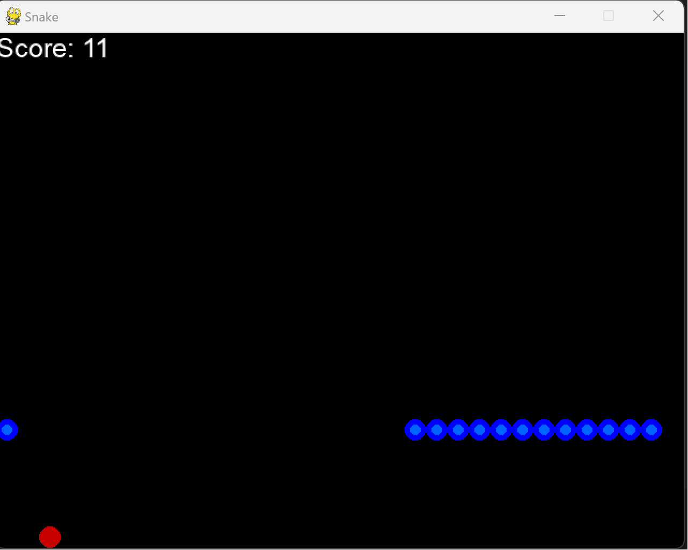

# Snake Game

A classic Snake game implemented in Python using the Pygame library.

## About

The Snake Game is a simple and fun game where you control a snake that grows longer as it eats food while avoiding collisions with the boundaries of the game area and itself. This project demonstrates the basic mechanics of game development using Pygame.

## Getting Started

### Prerequisites

Before you start, you need to have Python and Pygame installed on your system. If you don't have them, you can install Pygame using pip:
pip install pygame

## How to Play
Clone this repository or download the ZIP file.
-  git clone https://github.com/yourusername/Snake_Game.git

Navigate to the project directory.
-  cd Snake_Game  

Run the game.py script.
-  python game.py
  
Use the arrow keys (Up, Down, Left, Right) to control the snake.  

Eat the red food to grow your snake and increase your score.  

Avoid running into the boundaries of the game area or colliding with the snake itself. 

Try to achieve the highest score possible!  

## Features
Classic Snake gameplay.
Score tracking.
Wrapping around the screen edges (snake goes from one edge to the opposite edge).

## Contributing
Contributions are welcome! If you'd like to contribute to this project, please follow these steps:

Fork the project.
Create your feature branch (git checkout -b feature/YourFeature).
Commit your changes (git commit -m 'Add some feature').
Push to the branch (git push origin feature/YourFeature).
Open a pull request.
Please make sure to follow the code of conduct and contribute in a respectful and considerate manner.

## License
This project is licensed under the MIT License - see the LICENSE file for details.

## Acknowledgments
Thanks to the Pygame community for providing a great library for game development.
Inspiration for this project comes from the classic Snake game.
